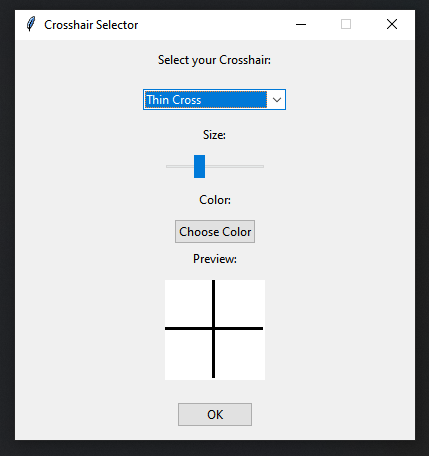

# Crosshair

A crosshair is a visual element, often in the form of a reticle, used in many video games to indicate the direction in which the weapon or sight is pointed. It lets the player know where he or she is going to shoot, making it easier to visualize the target. 

However, in some games, the crosshair can take on a strange or impractical shape, which can compromise accuracy. For example, a crosshair that is too wide, blurred or moving can make aiming difficult, thus undermining the player's effectiveness in precision shooting situations. A poorly designed crosshair can lead to aiming errors, and in games where precision is essential, this can seriously affect the player's performance.

Here is a homemade crosshair customizable



You can configure the size and color of the cursor, and once you click the “OK” button, the cursor appears right in the middle of your screen.

```python
import tkinter as tk
from tkinter import ttk, colorchooser
from tkinter import PhotoImage
from PIL import Image, ImageTk, ImageDraw
import io
import sys

class CrosshairApp:
    def __init__(self, root):
        self.root = root
        self.root.title("Crosshair Selector")
        self.root.geometry("400x400")
        self.root.resizable(False, False)

        # Default settings
        self.crosshair_size = tk.IntVar(value=100)
        self.crosshair_color = tk.StringVar(value="black")

        # Crosshair options
        self.crosshairs = {
            "Cross": self.create_crosshair_image(self.crosshair_size.get(), self.crosshair_size.get(), 10, self.crosshair_color.get()),
            "Circle": self.create_circle_image(self.crosshair_size.get(), self.crosshair_color.get()),
            "Triangle": self.create_triangle_image(self.crosshair_size.get(), self.crosshair_color.get()),
            "Thin Cross": self.create_crosshair_image(self.crosshair_size.get(), self.crosshair_size.get(), 2, self.crosshair_color.get()),
            "Thick Cross": self.create_crosshair_image(self.crosshair_size.get(), self.crosshair_size.get(), 20, self.crosshair_color.get())
        }

        self.selected_crosshair = tk.StringVar(value=list(self.crosshairs.keys())[0])

        # UI Setup
        self.create_ui()

        # Bind Ctrl+C to exit
        self.root.bind("<Control-c>", self.exit_program)

    def create_ui(self):
        ttk.Label(self.root, text="Select your Crosshair:").pack(pady=10)

        # Dropdown menu for crosshair selection
        self.dropdown = ttk.Combobox(
            self.root, textvariable=self.selected_crosshair, values=list(self.crosshairs.keys()), state="readonly"
        )
        self.dropdown.pack(pady=10)

        # Size slider
        ttk.Label(self.root, text="Size:").pack(pady=5)
        self.size_slider = ttk.Scale(self.root, from_=50, to=200, variable=self.crosshair_size, orient="horizontal", command=self.update_crosshair_options)
        self.size_slider.pack(pady=5)

        # Color picker
        ttk.Label(self.root, text="Color:").pack(pady=5)
        self.color_button = ttk.Button(self.root, text="Choose Color", command=self.choose_color)
        self.color_button.pack(pady=5)

        # Preview area
        self.preview_label = ttk.Label(self.root, text="Preview:")
        self.preview_label.pack()

        self.preview_canvas = tk.Canvas(self.root, width=100, height=100, bg="white")
        self.preview_canvas.pack(pady=10)

        self.update_preview()
        self.dropdown.bind("<<ComboboxSelected>>", lambda e: self.update_preview())

        # Apply button
        self.apply_button = ttk.Button(self.root, text="OK", command=self.apply_crosshair)
        self.apply_button.pack(pady=10)

    def create_crosshair_image(self, width, height, thickness, color):
        # Create a PIL Image for the crosshair
        image = Image.new("RGBA", (width, height), (255, 255, 255, 0))
        draw = ImageDraw.Draw(image)

        # Draw vertical and horizontal lines
        center_x = width // 2
        center_y = height // 2
        draw.rectangle([center_x - thickness // 2, 0, center_x + thickness // 2, height], fill=color)
        draw.rectangle([0, center_y - thickness // 2, width, center_y + thickness // 2], fill=color)

        return ImageTk.PhotoImage(image)

    def create_circle_image(self, size, color):
        # Create a PIL Image for the circle crosshair
        image = Image.new("RGBA", (size, size), (255, 255, 255, 0))
        draw = ImageDraw.Draw(image)

        # Draw circle
        center = size // 2
        radius = size // 3
        draw.ellipse([center - radius, center - radius, center + radius, center + radius], outline=color, width=3)

        return ImageTk.PhotoImage(image)

    def create_triangle_image(self, size, color):
        # Create a PIL Image for the triangle crosshair
        image = Image.new("RGBA", (size, size), (255, 255, 255, 0))
        draw = ImageDraw.Draw(image)

        # Draw triangle
        center = size // 2
        draw.polygon([
            (center, center - size // 3),
            (center - size // 3, center + size // 3),
            (center + size // 3, center + size // 3)
        ], outline=color, width=3)

        return ImageTk.PhotoImage(image)

    def update_crosshair_options(self, *args):
        size = self.crosshair_size.get()
        color = self.crosshair_color.get()

        self.crosshairs = {
            "Cross": self.create_crosshair_image(size, size, 10, color),
            "Circle": self.create_circle_image(size, color),
            "Triangle": self.create_triangle_image(size, color),
            "Thin Cross": self.create_crosshair_image(size, size, 2, color),
            "Thick Cross": self.create_crosshair_image(size, size, 20, color)
        }
        self.update_preview()

    def choose_color(self):
        color_code = colorchooser.askcolor(title="Choose Crosshair Color")[1]
        if color_code:
            self.crosshair_color.set(color_code)
            self.update_crosshair_options()

    def update_preview(self):
        selected_key = self.selected_crosshair.get()
        crosshair_image = self.crosshairs[selected_key]
        self.preview_canvas.delete("all")
        self.preview_canvas.create_image(50, 50, image=crosshair_image)
        self.preview_canvas.image = crosshair_image

    def apply_crosshair(self):
        selected_key = self.selected_crosshair.get()
        crosshair_image = self.crosshairs[selected_key]

        # Hide the window
        self.root.withdraw()

        # Place crosshair in the middle of the screen
        screen_width = self.root.winfo_screenwidth()
        screen_height = self.root.winfo_screenheight()
        x = (screen_width // 2) - 25
        y = (screen_height // 2) - 25

        crosshair_window = tk.Toplevel()
        crosshair_window.overrideredirect(True)
        crosshair_window.geometry(f"50x50+{x}+{y}")
        crosshair_window.attributes("-topmost", True)
        crosshair_window.attributes("-transparentcolor", "white")

        crosshair_label = tk.Label(crosshair_window, image=crosshair_image, bg="white")
        crosshair_label.image = crosshair_image
        crosshair_label.pack()

        # Ensure the crosshair remains on top
        def keep_on_top():
            try:
                crosshair_window.attributes("-topmost", True)
                crosshair_window.after(100, keep_on_top)
            except tk.TclError:
                pass

        keep_on_top()

        # Keep the crosshair visible
        crosshair_window.mainloop()

    def exit_program(self, event):
        self.root.destroy()
        sys.exit()

if __name__ == "__main__":
    try:
        root = tk.Tk()
        app = CrosshairApp(root)
        root.mainloop()
    except KeyboardInterrupt:
        print("Program terminated by user.")
        sys.exit(0)
``` 


