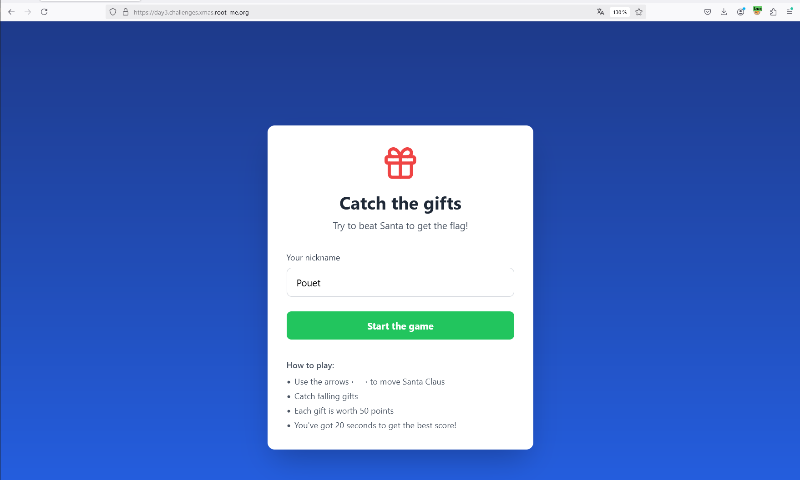
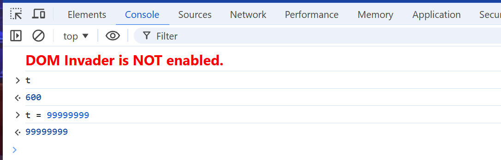
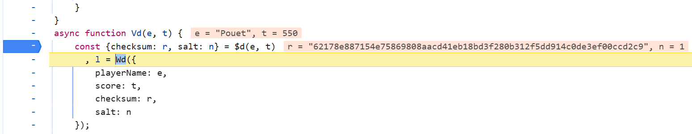
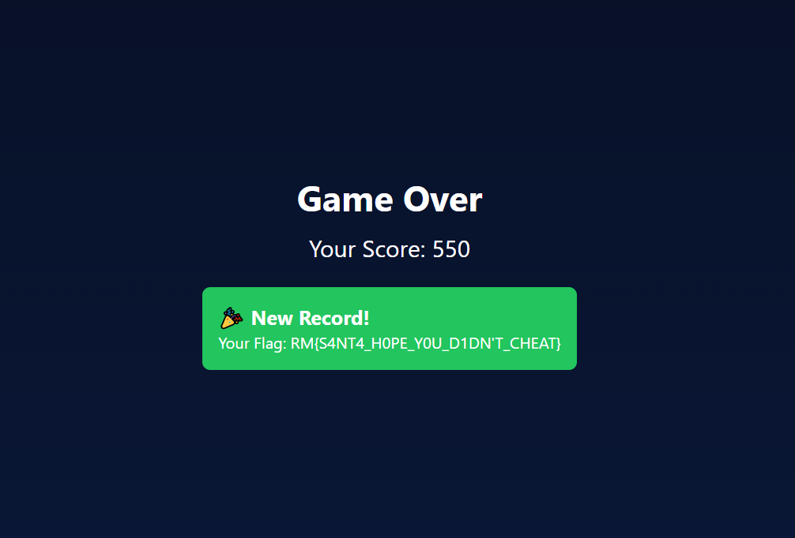

# Day 03 - Santa's Magic Sack

- Category: Web Game Hacking
- Difficulty: Very Easy
- Format: Blackbox

## Description

Santa has developed a web game where you have to catch presents, and as luck would have it, he's come out on top of the scoreboard. Can you beat him?

## Writeup

**TLDR: WebGame, Cheating, Weak cryptography, Browser breakpoint**



The game features a counting system that earns 50 points each time a gift is caught.


The aim is to cheat your way to beating Santa. The source code is minimized and obfuscated by React, making it difficult to read.

There are several ways of solving the challenge, such as setting breakpoints in the JS before the submitScore() or modifying the number of points earned when a gift is caught.

I'm going to present a few solutions to solve the challenge, but there are probably others.

### Solve 1 : Checksum recalculation

The data is sent encrypted, and given the size of the ciphertext it looks very much like AES blocks :

```bash
echo -n U2FsdGVkX1+qZtynOTJhSel74GtQsQL6C+96RytmLOgUyuLC8Q6LSPWWgiVIbjBIlVbUZoTnqVMNrcJ3NxPPpokFLdURLyI6MifS1ILGE0bJ9mZvM2IJfF9fC2zszPkzUnFdZhI5s03cHjbjooe6sYq0EGlkvEUdM8hzsyuvXiH3npqZbATOu0H6UIoCwRPO | base64 -d | xxd
00000000: 5361 6c74 6564 5f5f aa66 dca7 3932 6149  Salted__.f..92aI
00000010: e97b e06b 50b1 02fa 0bef 7a47 2b66 2ce8  .{.kP.....zG+f,.
00000020: 14ca e2c2 f10e 8b48 f596 8225 486e 3048  .......H...%Hn0H
00000030: 9556 d466 84e7 a953 0dad c277 3713 cfa6  .V.f...S...w7...
00000040: 8905 2dd5 112f 223a 3227 d2d4 82c6 1346  ..-../":2'.....F
00000050: c9f6 666f 3362 097c 5f5f 0b6c eccc f933  ..fo3b.|__.l...3
00000060: 5271 5d66 1239 b34d dc1e 36e3 a287 bab1  Rq]f.9.M..6.....
00000070: 8ab4 1069 64bc 451d 33c8 73b3 2baf 5e21  ...id.E.3.s.+.^!
00000080: f79e 9a99 6c04 cebb 41fa 508a 02c1 13ce  ....l...A.P.....
```

If the data is sent in AES, this means that somewhere in the code an AES key is presented to encrypt the data.

By grepping "AES" in JS source code we find the following function :

```javascript
var Md = hf.exports;
const gf = Rf(Md),
    Ud = "S4NT4_S3CR3T_K3Y_T0_ENCRYPT_DATA";

function Wd(e) {
    const t = JSON.stringify(e);
    return gf.AES.encrypt(t, Ud).toString()
}
```

The variable "ud" seems to be out AES key.

Thanks to this key, we can decrypt the AES data to recover the plaintext. Personally, I was a bit lazy and used the following site:

- [https://stackblitz.com/edit/cryptojs-aes-encrypt-decrypt?file=index.js](https://stackblitz.com/edit/cryptojs-aes-encrypt-decrypt?file=index.js)

It gave the following data:

```json
{
    "playerName": "aa",
    "score": 150,
    "checksum": "5bc5c2d255995b7ecf62de6442097ad8daf19b89da1e102ff651a018254f25ea",
    "salt": 3
}
```

Not surprisingly, we find the name we've entered, our score, as well as a salt and a checksum.

If the checksum is what it's supposed to be, if we modify the score then the backend will refuse our request because the checksum won't match. It acts as an integrity check.

We return to the power code to see how this checksum is calculated, since it is necessarily calculated on the client side.

We discover the following content :

```javascript
function $d(e, t) {
    const r = Math.floor(Math.random() * 9) + 1,
        n = `${e}-${t}-${r}`;
    return {
        checksum: gf.SHA256(n).toString(),
        salt: r
    }
}
async function Vd(e, t) {
    const {
        checksum: r,
        salt: n
    } = $d(e, t), l = Wd({
        playerName: e,
        score: t,
        checksum: r,
        salt: n
    });
    try {
        return await (await fetch("/api/scores", {
            method: "POST",
            headers: {
                "Content-Type": "application/json"
            },
            body: JSON.stringify({
                data: l
            })
        })).json()
    } catch (i) {
        return console.error("Error submitting score:", i), {
            success: !1
        }
    }
}
async function Qd() {
    try {
        return await (await fetch("/api/scores")).json()
    } catch (e) {
        return console.error("Error fetching scores:", e), []
    }
}
```

The function $d() indicate the the checksum is calculated as following :

```javascript
n = `${e}-${t}-${r};`
```

So we can confirm we can recalculate the previous hash :

```bash
echo -n 'aa-150-3' | sha256sum
5bc5c2d255995b7ecf62de6442097ad8daf19b89da1e102ff651a018254f25ea  -
```

As we now how to craft a new checksum, and how to encrypt data we will be able to cheat to change our score.

First get the checksum with our new score :

```bash
echo -n 'h4x0r-99999999-3' | sha256sum
8997c4c4f0a4437c0422e5ef48204c8cf1c2a5d0e689a73d46d573186bb2055c  -
```

Then, encrypt the following data with CryptoJS and the AES key :

```json
{
    "playerName": "h4x0r",
    "score": 99999999,
    "checksum": "8997c4c4f0a4437c0422e5ef48204c8cf1c2a5d0e689a73d46d573186bb2055c",
    "salt": 3
}
```

Finally send the ciphertext to the endpoint, beat santa and get the flag!

```bash
curl -X POST -H 'Content-type: application/json' -d '{"data":"U2FsdGVkX181fx1sRYynx0NhUaHbW53RIAjW75iq9kDhLFKu3x9hqVb5DYa6gZQsK1EW/f08Tvx2QF8xE+os0JguMRplk/tfGMEazdPZmNuxdyPONbpSEAAx4GwG17gVL7ZUM4rqsPqfhsz/Hr2ghqn+BBgfMN1fPRCOar9iXF5pIQc4QAui2H+QZhVkF0L0"}' http://127.0.0.1:3000/api/scores
{
    "success": true,
    "isNewRecord": true,
    "flag": "RM{S4NT4_H0PE_Y0U_D1DN'T_CHEAT}"
}
```

### Solve 2 : Breakoint

I think the easiest way to solve the challenge is to use the mechanism of breakpoint in your favorite browser, to change the score before to save it.

You have to put 2 breakpoint, before the calcul of the checksum and before the POST request to save data.

So run a game and put a breakpoint before the calcul of checksum:


Then switch to the console and change the score:



Finally, put a second breakpoint before the request to send data and change to score :



Then continue the processus and get the flag!

