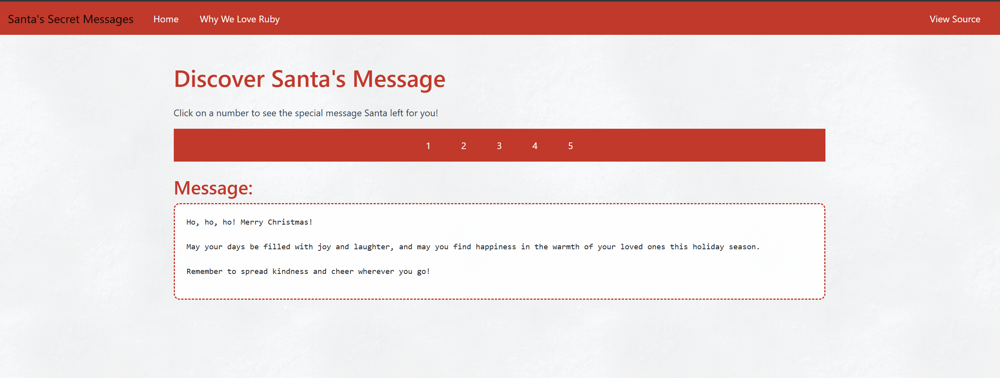
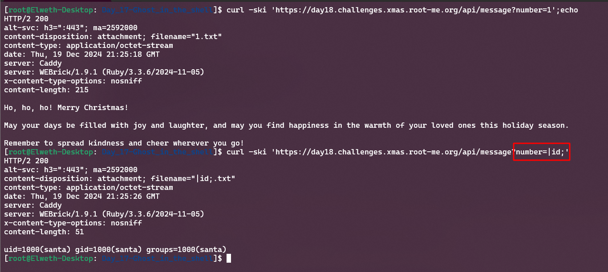
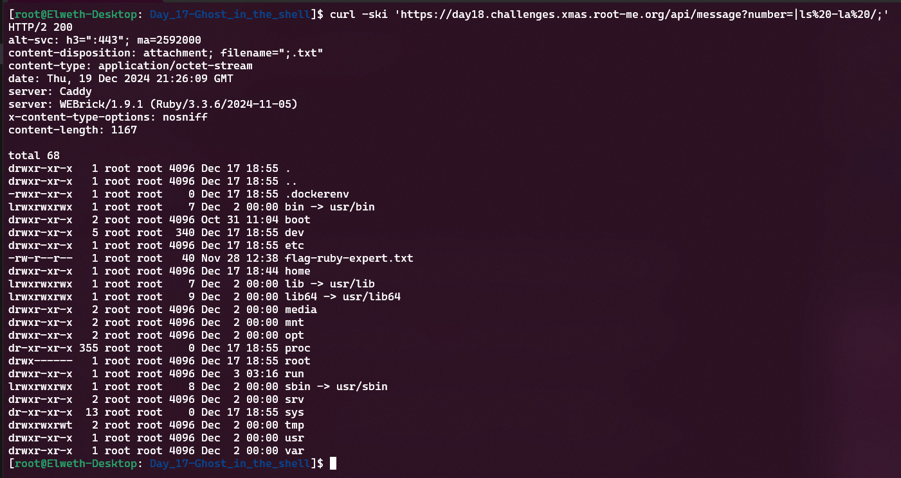
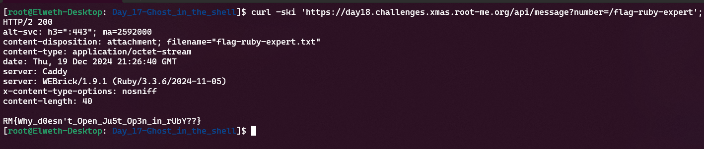

# Day 18 - Santa's sweet words

- Category: Web
- Difficulty: Easy
- Format: Whitebox

## Description

Santa has left you a few kind words for the end of the year ... you wouldn't do her any harm, would you?

The flag is at the root / of the server.

## Writeup

**TLDR: Ruby, open function RTFM**



When we click on specific number the following client-side code is triggered to display message :

```javascript
async function showMessage(number) {
    try {
    const response = await fetch(`/api/message?number=${number}`);
    if (!response.ok) {
        throw new Error('Error during download. Make sure the number is between 1 and 5.');
    }
    const message = await response.text();
    document.getElementById('message-content').textContent = message;
    } catch (error) {
    document.getElementById('message-content').textContent = error.message;
    }
}
```

Another page /source is available revealing the server-side source code :

```ruby
require 'sinatra'

set :bind, '0.0.0.0'
set :show_exceptions, false
set :environment, :production

get '/' do
  send_file File.join(settings.public_folder, 'index.html')
end

get '/love' do
    send_file File.join(settings.public_folder, 'love.html')
end

get '/api/message' do
  number = params[:number]

  file_name = "#{number}.txt"

  content = open(file_name, "rb") { |f| f.read }
  content_type 'application/octet-stream'
  attachment file_name
  body content
end

get '/source' do
  content_type 'text/plain'
  File.read(__FILE__)
end
``` 

To display the message, the backend retrieves the number from the URL, then opens the {number}.txt file. There may be a path traversal, but the suffix added to the end of the filename will block us.

The official Ruby documentation tells us that the `open` function can be used for many things. In fact, the open function can be used to open files, TCP tunnels and even subprocesses!

- [https://apidock.com/ruby/Kernel/open](https://apidock.com/ruby/Kernel/open)

In fact, this function can also be used to execute commands if the argument begins with a pipe `|`:

There's still the '.txt' suffix added at the end of our string, but that's not a problem since it will be added at the end of our bash command, so we'll be able to comment on it.



The code execution is confirmed : `uid=1000(santa) gid=1000(santa) groups=1000(santa)`

We can execute arbitrary `ls -la /` to list file at the root of the server : 



The flag is stored in `/flag-ruby-expert` : 

